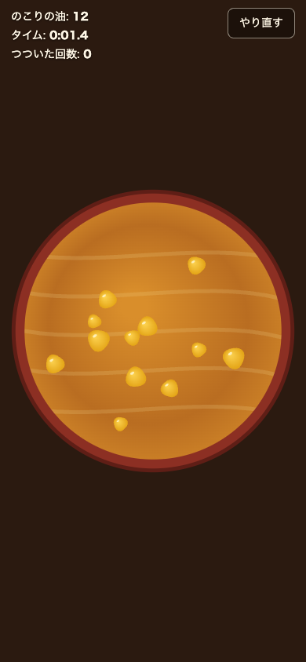

# 油すくい (Oil Game)

ラーメンの上に浮いた油を箸でつついて、小さい油を合体させてひとつの大きな油にする暇つぶしゲーム。
モバイルブラウザでのタッチ操作を前提にした Web アプリとして実装している
(PC のマウス操作でも遊べる)。

Steam の [『油』](https://store.steampowered.com/app/2444000/_/?l=japanese) にインスパイアされた習作。

| 開始直後 | つついて合体させたあと |
| --- | --- |
|  |  |

## 遊び方

- 丼の中の油を指 (箸) でなぞると、油が押されて動く
- 油同士がぶつかると合体して大きくなる
- **すべての油をひとつにまとめたらクリア**。タイムとつついた回数が記録される
- ベストタイムは端末 (localStorage) に保存される
- 右上の「やり直す」でいつでも再スタートできる

## 動作環境

- Node.js 24 (開発時に使用したバージョン。18 以上なら動作想定)
- または Docker (Node を手元に入れたくない場合)

## セットアップと実行

### npm で動かす

```bash
npm ci        # 依存関係のインストール
npm run dev   # 開発サーバ起動 (http://localhost:5173)
```

`--host` 付きで起動するため、同じ LAN のスマホから
`http://<PCのIPアドレス>:5173` を開くと実機で動作確認できる。

### Docker で動かす

```bash
docker compose up app   # 本番相当 (http://localhost:8080)
docker compose up dev   # 開発サーバ + ホットリロード (http://localhost:5173)
```

### 本番ビルド

```bash
npm run build     # dist/ に静的ファイルを出力
npm run preview   # ビルド結果をローカルで確認
```

## 設定 (URL クエリパラメータ)

実行時の挙動は URL クエリで変更できる。不正な値・範囲外の値は既定値にフォールバックする。

| パラメータ | 内容 | 既定値 | 範囲 |
| --- | --- | --- | --- |
| `blobs` | 初期の油の個数 | 24 | 2〜80 |
| `seed` | 乱数シード。同じ値なら同じ初期配置になる | 現在時刻 | 0〜2^31-1 |
| `log` | ログレベル (`debug` / `info` / `warn` / `error`) | `info` | - |

例: `http://localhost:5173/?blobs=40&seed=123&log=debug`

## テスト

```bash
npm test          # 単体テスト (Vitest)。コアロジック 31 ケース
npm run check     # 型チェック → 単体テスト → ビルド を一括実行 (CI と同一)
npm run smoke     # ヘッドレス Chrome でのスモークテスト (要: npm run dev 起動中)
```

スモークテストはタッチ操作をシミュレートし、「つつくと油が合体する」
「リセットで初期状態に戻る」「コンソールエラーが出ない」ことを自動検証する。
既定では macOS の Google Chrome を使う (`CHROME_PATH` 環境変数で変更可能)。

## CI

GitHub Actions ([.github/workflows/ci.yml](.github/workflows/ci.yml)) で、
push / pull request ごとに `scripts/check.sh` と Docker イメージのビルドを実行する。

## リポジトリ構成

```
├── src/            アプリ本体 (構成の詳細は docs/architecture.md を参照)
├── tests/          コアロジックの単体テスト
├── scripts/        省力化スクリプト (一括チェック・スモークテスト)
├── docs/           設計資料 (処理フロー図・物理パラメータの根拠)
├── docker/         nginx 設定
├── Dockerfile      本番配信イメージ (マルチステージビルド)
└── docker-compose.yml
```

## 設計資料

処理の流れ (フローチャート・シーケンス図) と物理パラメータの決め方は
[docs/architecture.md](docs/architecture.md) にまとめている。
