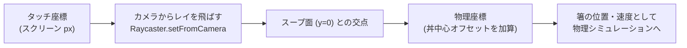
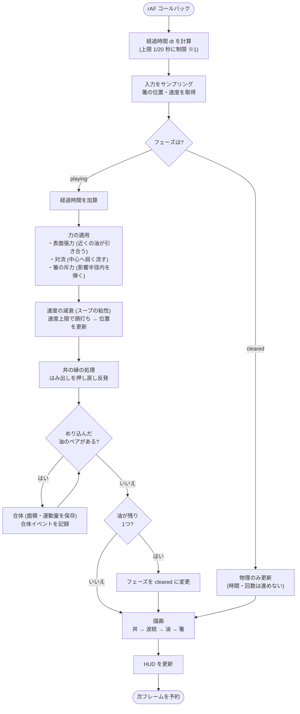
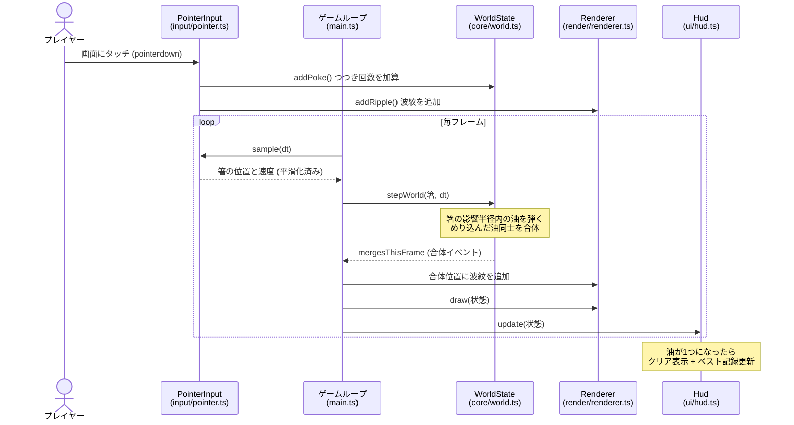

# 設計資料

## 全体構成

DOM / Canvas に依存する層と、依存しない純粋ロジック層 (`src/core/`) を分離している。
物理・合体などのゲームルールはすべて `core` に置き、単体テストの対象にしている。

```
src/
├── main.ts          エントリポイント。設定読み込みと各層の配線、ゲームループ
├── config.ts        設定の既定値と URL クエリからの読み込み (検証付き)
├── logger.ts        レベル制御付きロガー (?log=debug で詳細ログ)
├── core/            純粋ロジック層 (DOM 非依存・単体テスト対象)
│   ├── vec2.ts      2次元ベクトル演算
│   ├── rng.ts       シード指定可能な擬似乱数 (mulberry32)
│   ├── blob.ts      油の粒の定義と合体処理
│   └── world.ts     物理シミュレーションとゲーム進行
├── render/          描画層 (状態を読むだけで変更しない)
│   ├── types.ts     GameRenderer インターフェース
│   ├── renderer2d.ts  Canvas 2D 実装 (フォールバック用)
│   └── renderer3d.ts  three.js 実装 (既定)
├── input/           タッチ/マウス → 箸の位置・速度への変換
└── ui/              HUD (DOM)。スコア表示・リセット・ベスト記録
```

## 3D 描画の座標系

物理シミュレーションは 2D のまま変えず、描画だけを 3D 化している。
物理座標 (x, y) は three.js シーンのスープ面 (y=0 平面) 上の (x, z) に対応し、
丼の中心をシーン原点に置く。

カメラは斜め上から見下ろすため、**タッチしたスクリーン座標と物理座標が
一致しない**。`GameRenderer.screenToWorld()` がこの変換を担い、3D 実装では
カメラからのレイをスープ面に交差させて求める (2D 実装では恒等変換)。



## ゲームループの処理の流れ

毎フレーム (`requestAnimationFrame`) の処理をフローチャートで示す。



※1: タブが非アクティブになると dt が数十秒になり得るため、上限を設けて物理の発散を防ぐ。

## つつき操作から合体までの流れ

プレイヤーの操作がどのように状態へ反映されるかをシーケンス図で示す。



図に描いていないこと: リサイズ・画面回転時の座標の写し替え (`main.ts` の
`handleResize`)、localStorage が使えない環境でのベスト記録のスキップ。

## 物理パラメータの根拠

`WorldParams` の値 (`main.ts` の `computeParams`) は以下の方針で決めている。

| パラメータ | 方針 |
| --- | --- |
| `damping` (0.25) | 1秒後に速度が 25% まで減衰。「粘性のあるスープに浮く油」の、押すとゆっくり滑って止まる感触を出す |
| `attraction` / `attractionRange` | 放置していても近くの油がゆっくり寄って勝手に合体する程度。ゲームを能動的に進めるには箸が必要なバランスにする |
| `pokeStrength` | ひと突きで油が丼の 1/3 ほど滑る強さ。強すぎると縁に散らばり逆に難しくなる |
| `convection` | 縁に張り付いた油が数秒で中央へ戻ってくる最小限の強さ |
| 丼半径・油サイズ | 画面の短辺に比例させ、端末サイズが違っても同じ密度・難易度になるようにする |
| 合体しきい値 (0.85) | 縁が触れただけでは合体せず少しめり込んだら合体。すれ違いで意図せず合体するのを防ぐ |

## 合体の物理

- 油の大きさは半径ではなく **面積** を正として持つ。合体時は面積の合計を保存し、
  画面上の油の総量が変わらないようにする (半径だと合体のたびに総量が増えて見える)。
- 位置は面積による重心、速度は運動量 (面積 × 速度) 保存で決める。
  小さい油が大きい油に「吸い込まれる」ように見えるのはこのため。
